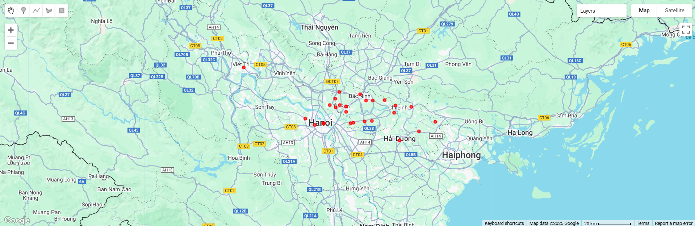

# Giải thích hiện tượng massive missing values ở một số đặc trưng

## 1. Thống kê mức độ missing value của các đặc trưng khi so sánh với Cloud Coverage

- Nhìn vào dữ liệu thống kê, có thể đặt ra nghi vấn rằng Cloud coverage ảnh hưởng đến việc thu thập dữ liệu về các đặc trưng CO, HCHO, NO2, SO2 ở vệ tinh.
- Ngoài ra, chắc chắn còn những yếu tố khác dẫn đến việc missing values mà nhóm sẽ đề cập sau

## 2. Phân tích nghi vấn

### 2.1. Vị trí địa lý
| No. | ID | Tỉnh/ thành |
|:--:|:--:|:-----------:|
| 1 | 5 | Hà Nội |
| 2 | 19 | Hà Nội |
| 3 | 51 | Bắc Ninh |
| 4 | 52 | Bắc Ninh |
| 5 | 53 | Bắc Ninh |
| 6 | 54 | Hải Dương |
| 7 | 60 | Bắc Ninh |
| 8 | 62 | Bắc Ninh |
| 9 | 66 | Bắc Ninh |
| 10 | 71 | Bắc Ninh |
| 11 | 79 | Hà Nội |
| 12 | 155 | Bắc Ninh |
| 13 | 156 | Bắc Ninh |
| 14 | 157 | Hà Nội |
| 15 | 158 | Bắc Giang |
| 16 | 159 | Bắc Ninh |
| 17 | 160 | Bắc Ninh |
| 18 | 161 | Bắc Ninh |
| 19 | 162 | Bắc Ninh |
| 20 | 163 | Bắc Ninh |
| 21 | 169 | Bắc Nình |
| 22 | 172 | Hải Dương |
| 25 | 173 | Hải Dương |
| 24 | 175 | Hải Dương |
| 25 | 195 | Phú Thọ |
| 26 | 300 | Hà Nội |

- Các trạm thu thập nằm ở các tình thành Bắc Ninh, Hà Nội, Bắc Giang, Hải Dương, Phú Thọ. Các vị trí này nằm ở vùng Đồng bằng sông Hồng hay còn gọi là Đồng bằng Bắc Bộ/ Đồng bằng Sông Hồng (Hà Nội, Bắc Ninh và Hải Dương) và cùng Trung du, miền núi Bắc Bộ (Bắc Giang, Phú thọ) nhưng đều giáp ranh giới vùng đồng bằng, tạo thành vùng chuyển tiếp.

### 2.2. Phân tích vị trí địa lý
- Như vậy, hầu hết vị trí các trạm đều nằm lân cận ở vùng [Đồng bằng sông Hồng](https://vi.wikipedia.org/wiki/%C4%90%E1%BB%93ng_b%E1%BA%B1ng_s%C3%B4ng_H%E1%BB%93ng). 
- Đặc điểm địa lý chung:
    - Nằm ở vĩ độ khoảng 20–21.5° Bắc, gần vành đai khí hậu nhiệt đới gió mùa.
    - Gần biển (vịnh Bắc Bộ) → dễ chịu ảnh hưởng của ẩm và gió mùa biển.- Có nhiều sông lớn (sông Hồng, sông Đà, sông Cầu…) → độ ẩm không khí cao quanh năm.

- [Đặc điểm khí hậu](https://vi.wikipedia.org/wiki/Kh%C3%AD_h%E1%BA%ADu_nhi%E1%BB%87t_%C4%91%E1%BB%9Bi_gi%C3%B3_m%C3%B9a): 
    - Nhiệt đới gió mùa, cận nhiệt đới ẩm, có mùa hè nóng ẩm nhưng mùa đông phi nhiệt đới lạnh khô
    -  Mùa hè (tháng 5–10):
        - Nóng ẩm, mưa nhiều, độ ẩm trung bình ~80–85%.
        - Gió mùa Tây Nam và Đông Nam mang hơi ẩm từ biển vào → tạo điều kiện hình thành mây đối lưu dày đặc vào buổi chiều.
    - Mùa đông (tháng 11–4):
        - Khí hậu lạnh ẩm, nhiều sương mù, mây tầng thấp.
        - Gió mùa Đông Bắc mang không khí lạnh và ẩm từ lục địa Trung Quốc, dẫn đến mây che phủ kéo dài, dù lượng mưa ít.

📌 Kết quả: Cả năm đều có mây nhiều, dù mưa nhiều hay ít.

### 2.3. Ảnh hưởng của vị trí địa lý đến missing values

- Hệ quả với Sentinel-5P
    - Sentinel-5P đo các khí như NO₂, SO₂, CO, HCHO bằng cách quan sát ánh sáng phản xạ từ mặt đất qua khí quyển.
    - Cloud ảnh hưởng đến việc thu hồi khí quyển tầng đối lưu
        > [Intercomparison of Sentinel-5P TROPOMI cloud products for tropospheric trace gas retrievals](https://www.knmi.nl/research/publications/intercomparison-of-sentinel-5p-tropomi-cloud-products-for-tropospheric-trace-gas-retrievals)
        - Nghiên cứu này chỉ sự khác biệt giữa các thuật toán thu hồi mây được tìm thấy đặc biệt ở những đám mây có độ cao thấp với ngưỡng "cloud fraction" là 0.2, tức là những đám mây đặc biệt quan trọng đối với việc thu hồi khí quyển tầng đối lưu.
    - Cloud có thể gây ra các hiệu ứng đối với phép đo khí quyển
        > [he operational cloud retrieval algorithms from TROPOMI on board Sentinel-5 Precursor](https://amt.copernicus.org/articles/11/409/2018/)
        - Nghiên cứu này chỉ ra 3 hiệu ứng chính mà Cloud ảnh hưởng đến các phép đo khí quyển:
            - Hiệu ứng albedo: Liên quan đến sự tăng cường phản xạ đối với các cảnh có mây so với cảnh không có mây.​
            - Hiệu ứng che chắn: Phần cột khí quyển dưới mây bị che khuất bởi chính các đám mây.​
            - Tăng cường hấp thụ trong mây: Liên quan đến sự tán xạ nhiều lần bên trong mây, làm tăng độ dài đường quang học. 

    - Cloud coverage thu được ở Sentinel=5P ảnh hưởng đến các phép thu khí khác
        > [Dẫn chứng từ Nghiên cứu về sản phẩm mây của TROPOMI](https://sentinel.esa.int/documents/247904/3541451/Sentinel-5P-Cloud-Level-2-Product-Readme-File)
        - Khi có mây dày (cloud_fraction > 0.2 hoặc 0.3), tín hiệu ánh sáng bị hấp thụ hoặc tán xạ → không đủ tín hiệu để phân tích khí → dữ liệu bị đánh dấu là "không hợp lệ" hoặc missing.
        - Nghiên cứu trên chỉ ra rằng các đám mây có độ cao thấp và tỉ lệ mây che phủ trên 0,2, sự khác biệt giữa các phương pháp thu hồi mây trở nên đáng kể, ảnh hưởng trực tiếp đến việc thu hồi các khí trong tầng đối lưu như NO₂ và HCHO. 

    - Cloud làm suy giảm đáng kể độ chính xác và khả năng quan trắc bằng vệ tinh ở khu vực Đông Nam Á, bao gồm Việt Nam
        > [Satellite estimation of photosynthetically active radiation in Southeast Asia: Impacts of smoke and cloud cover](https://agupubs.onlinelibrary.wiley.com/doi/full/10.1029/2003JD003807)
        - Bài báo này không nghiên cứu trực tiếp về khí CO, NO₂, HCHO, SO₂, nhưng nó cho thấy rất rõ Cloud ở vùng Đông Nam Á ảnh hướng đến các phép đo vệ tinh