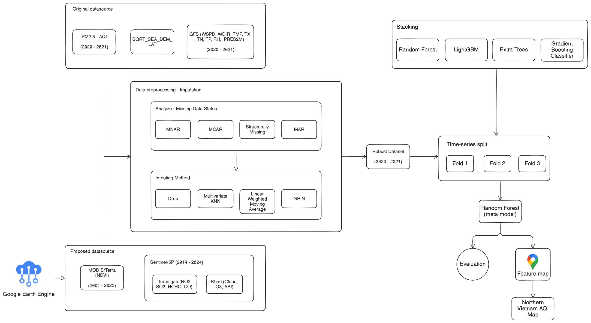
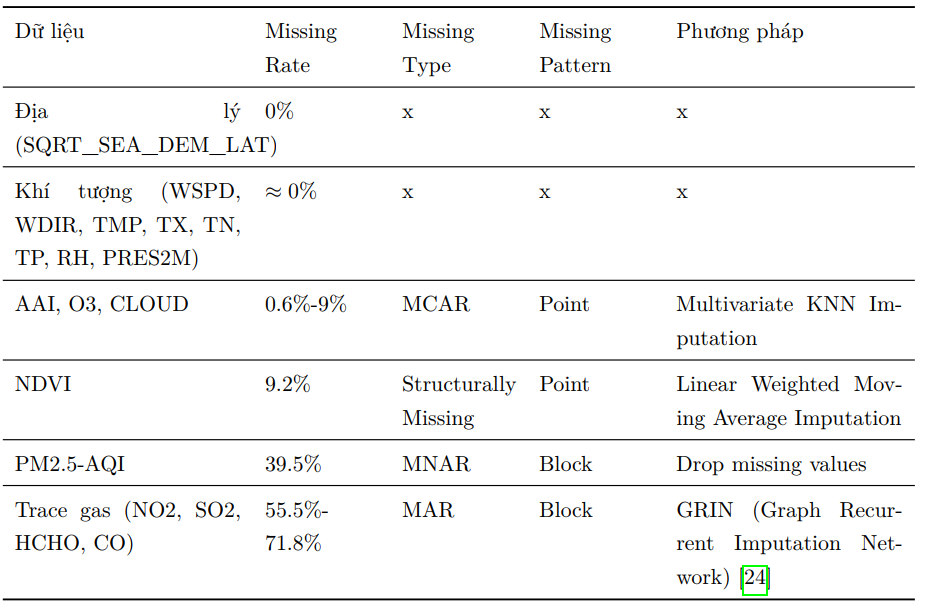

# PM2.5 Air Quality Index (AQI) Estimation Project

This research focuses on building a comprehensive and prominent processing framework to **estimate PM2.5-AQI concentrations** in the Northern region of Vietnam. The process includes data collection from multiple sources, preprocessing, missing data imputation, training machine learning models, evaluation, and result visualization.

Refer to the report for detailed methodology and results: `INT3401E_2_AI__PM2.5-AQI Estimation Report.pdf`.

## Proposed Processing Framework

The overall project workflow is described in the image below:



1.  **Phase 1: Data Collection from GEE Platform (`fetch_data`, `GEE`, `data/`)**
    *   **Data Sources:** Use Google Earth Engine (GEE) to collect data from various satellite sources:
        *   **MODIS/Terra:** Provides **NDVI** (Normalized Difference Vegetation Index) data.
        *   **Sentinel-5P:** Provides data on trace gases such as **CO** (Carbon Monoxide), **HCHO** (Formaldehyde), **NO₂** (Nitrogen Dioxide), **SO₂** (Sulfur Dioxide), and other atmospheric parameters including **O₃** (Ozone), **CLOUD** (Cloud Cover), and **AAI** (Absorbing Aerosol Index, formerly UV).

2.  **Phase 2: Preprocessing and Missing Data Imputation (`data_imputation/`, `visualization/`)**
    *   **Missing Data Assessment:**
        *   Analyze the percentage of missing data for each feature.
        *   Classify missing data types specific to spatio-temporal data: Point missing, Sequence Missing, and Block missing.
        *   Identify the mechanisms causing missing data:
            *   MCAR (Missing Completely At Random): Missing data is unrelated to observed or unobserved data.
            *   MAR (Missing At Random): Missing data is systematically related to observable data.
            *   MNAR (Missing Not At Random): Missing data is systematically related to unobserved data, meaning the absence is related to unmeasured events or factors.
            *   Structurally Missing: Additionally, structurally missing data is considered independently of the above three groups.
    *   **Imputation Strategy:** Based on detailed assessment, apply appropriate methods:
        *   **Drop:** Remove rows/columns to ensure data distribution integrity.
        *   **KNN Imputation:** Use the K-Nearest Neighbors algorithm to estimate missing values based on neighboring data points (`knn_imputation.ipynb`).
        *   **Linear Weighted Moving Average (LWMA):** Apply linear weighted moving average, particularly effective for time-series data (`linear_weighted_moving_average.ipynb`, `linear_weighted_moving_average.py`).
        *   **GRIN (Graph Recurrent Imputation Network):** Use a graph-based recurrent neural network to handle complex spatio-temporal relationships (`grin_spatiotemporal.ipynb`).
    *   **Result Storage:** Imputed data is saved (e.g., `ndvi_imputed.csv`, `tracegas_imputed.csv`, `CLOUD_O3_AAI_imputed.csv`, `atmospheric_imputed.csv`).

   The image below details other missing data recovery strategies corresponding to the missing data status.
   

3.  **Phase 3: Post-Imputation Data Evaluation and Model Building (`visualization/`, `model/`)**
    *   **Post-Imputation Evaluation:**
        *   **Visualization:** Compare data distribution before and after imputation to ensure validity and preservation of data structure (`imputation visualization.ipynb`).
        *   **Correlation Matrix:** Construct and analyze the correlation matrix between features (including imputed data) and the target variable PM2.5/AQI (`correlation_matrix.ipynb`).
    *   **Model Building, Training, and Evaluation:**
        *   **Feature Engineering:** Create or select important features (`Feature-engineering.ipynb`).
        *   **Model Training:** Use the PyCaret library (`experiment.ipynb`) to quickly experiment and compare the performance of various machine learning models, including baseline models such as:
            *   Decision Tree Classifier
            *   AdaBoost Classifier
            *   Gradient Boosting Classifier
            *   LightGBM
            *   K Neighbors Classifier
            *   Extra Trees Classifier
            *   Logistic Regression
            *   SVM - Linear Kernel
            *   Linear Discriminant Analysis
            *   Ridge Classifier
            *   Naive Bayes
        *   **Main Models:** Focus on deeper training of potential models like Random Forest, Light Gradient Boosting, Extra Trees Classifier, and Gradient Boosting Classifier combined with Stacking technique using a meta-model and Random Forest.
        *   **Ensemble Learning:** Explore Ensemble techniques like Bagging, Boosting, Stacking, Blending to improve prediction performance.
        *   **Hyperparameter Tuning:** Optimize model parameters (`Tuning.ipynb`).
        *   **Data Splitting:** Apply time-series data splitting methods (`time_series_split.py`).
        *   **Comprehensive Evaluation:** Use metrics like Accuracy, F1-score, AUC, Recall, Precision, Kappa, MCC and compare with baseline models (`Baseline_with_ONKK.ipynb`).
        *   **Model Storage:** Save the best models (`Inference.ipynb`).

4.  **Phase 4: AQI Map Construction (`draw_map/`)**
    *   **Result Processing:** The models experimentally found by the group to yield good results will be stored and used for generating predictions.
    *   **Map Creation:** Use prediction results to create spatial distribution maps of the AQI index for the Northern region of Vietnam on selected dates (`draw_map.ipynb`).
    *   **Map Storage:** Map images are saved in `draw_map/Feature Maps/AQI Map Images/`.

## Directory Structure

```
.
├── data/                     # Contains raw and consolidated data
│   ├── consolidation/        
│   ├── meteorological/       
│   └── satellite-based/      
├── data_imputation/          # Contains Notebooks and scripts for missing data imputation
├── draw_map/                 # Notebooks, scripts, and data/images related to drawing AQI maps
│   ├── Feature Maps/         # Data and images for feature maps and AQI
│   │   ├── AQI Map Images/   # AQI map images for each day
│   │   ├── Feature_Maps/     # Raster data for features (can be used for mapping)
│   │   └── Predicted Labels/ 
│   ├── draw_map.ipynb        
│   ├── feature_maps_data.csv 
│   ├── post_processing.ipynb 
│   └── time.csv              
├── fetch_data/               # Utility Modules for calling and accessing data
├── GEE/                      # Contains scripts for Google Earth Engine data collection (.js) and related documents/images
├── model/                    # Contains notebooks for model building, training, tuning, and evaluation
├── visualization/            # Contains notebooks for data visualization and analysis results
├── INT3401E_2_AI__PM2.5-AQI Estimation Report.pdf # Detailed project report
├── proposed_framework.jpg    # Image describing the proposed process/framework
└── Readme.md                
```

## Contributors

*   [Nguyễn Hữu Thế - 22028155](https://github.com/thebeo2004)
*   [Vũ Thị Minh Thư - 22028116](https://github.com/VuThiMinhThu2004)
*   [Lê Thị Hải Anh - 22028162](https://github.com/anizme)
*   [Nguyễn Hữu Tiến - 22028180](https://github.com/tien1712)
